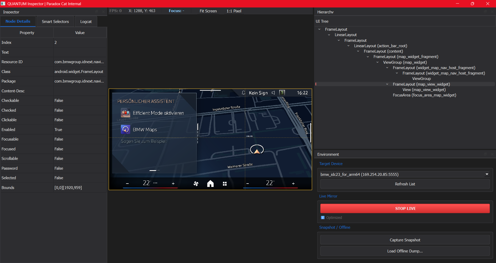
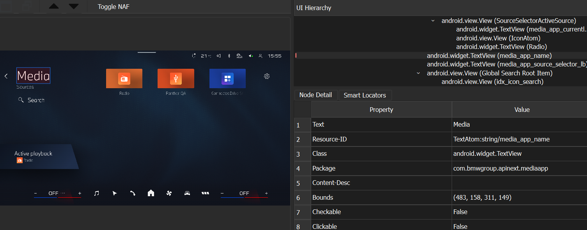

# QUANTUM Inspector (QA Snapshot Inspector)

<p align="center">
	
</p>

<p align="center">
	<b>Professional-grade Android UI snapshot inspector</b><br/>
	Live mirror + offline analysis + robust locator generation
</p>

<p align="center">
	<a href="README.md"></a>
	<a href="README.md"></a>
	<a href="README.md"></a>
	<a href="LICENSE"></a>
</p>

<p align="center">
	<a href="docs/ARCHITECTURE.md">Architecture</a> •
	<a href="docs/USAGE_GUIDE.md">Usage Guide</a> •
	<a href="docs/TROUBLESHOOTING.md">Troubleshooting</a> •
	<a href="docs/QUANTUM%20INSPECTOR%20-%20EN.pdf">Internal Paper</a>
</p>

Project owner and technical authority: David Erik García Arenas (QA, Paradox Cat).



V1 PoC (current build).

> [!NOTE]
> BMW Type Next is a licensed font. If it is not available, the UI falls back to Segoe UI.

> [!IMPORTANT]
> PoC validation plan for AI-generated tests: [docs/POC_VALIDATION.md](docs/POC_VALIDATION.md)

## What it does

| Area | Capability |
| --- | --- |
| Live | Scrcpy (fast) or ADB mirror with optional input control |
| Performance | Stream resolution presets (Native, 4K, 2K, 1080p, 720p, 1024) |
| Offline | dump.uix picker + offline logcat view |
| UI Tree | Auto-follow hover, expand on focus, selection lock (Enter/click) |
| Inspector | Node properties (text, bounds, resource-id, etc.) |
| Locators | XPath + Appium Java/Python formats |
| Logging | Logcat tab + separate System Log dock |
| Snapshot | Re-capture last snapshot (one-click refresh) |
| Devices | IP connect + recent device history + devices.json profiles |
| Diagnostics | Corrupted snapshot detection (zero nodes/invalid bounds) |

> [!TIP]
> Use Offline mode to inspect snapshots without a connected device.

## Quick start

- [ ] Create venv and install deps
- [ ] Run the app
- [ ] Load a dump or start live mirror

## Documentation

| Resource | Link |
| --- | --- |
| Architecture | [docs/ARCHITECTURE.md](docs/ARCHITECTURE.md) |
| scrcpy Integration | [docs/SCRCPY_INTEGRATION.md](docs/SCRCPY_INTEGRATION.md) |
| Implementation Log | [docs/IMPLEMENTATION_LOG.md](docs/IMPLEMENTATION_LOG.md) |
| Usage Guide | [docs/USAGE_GUIDE.md](docs/USAGE_GUIDE.md) |
| Troubleshooting | [docs/TROUBLESHOOTING.md](docs/TROUBLESHOOTING.md) |

## Visuals

<details>
<summary>UI example (what each section shows)</summary>



UI_Example: guidance screenshot to explain what each section shows when you open a screen.
</details>

## Internal papers

<details>
<summary>Confidential PDFs</summary>

| Title | Link |
| --- | --- |
| QUANTUM INSPECTOR - EN | [docs/QUANTUM%20INSPECTOR%20-%20EN.pdf](docs/QUANTUM%20INSPECTOR%20-%20EN.pdf) |
| Especificaciones Técnicas QUANTUM Inspector Android Automotive | [docs/Especificaciones%20T%C3%A9cnicas%20QUANTUM%20Inspector%20Android%20Automotive.pdf](docs/Especificaciones%20T%C3%A9cnicas%20QUANTUM%20Inspector%20Android%20Automotive.pdf) |
| Whitepaper técnico interno  QUANTUM INSPECTOR 2 | [docs/Whitepaper%20t%C3%A9cnico%20interno%20%20QUANTUM%20INSPECTOR%202.pdf](docs/Whitepaper%20t%C3%A9cnico%20interno%20%20QUANTUM%20INSPECTOR%202.pdf) |

</details>

> [!CAUTION]
> Internal papers are confidential. Do not distribute outside approved teams.

## Prerequisites

- Python 3.11+
- Windows 11 (designed for, but works on macOS/Linux)
- ADB (optional, for live mirror + capture)

## Snapshot format

Each snapshot folder can include:

| File | Purpose |
| --- | --- |
| screenshot.png | ADB screencap |
| dump.uix | UIAutomator XML dump |
| focus.txt | Focused window summary (optional) |
| meta.json | Device info, activity, timestamps |
| logcat.txt | Log output (optional) |

Missing files are handled gracefully with warnings.

## Installation

1) Create a virtual environment:

```bash
python -m venv venv
venv\Scripts\activate
```

2) Install dependencies:

```bash
pip install -r requirements.txt
```

## Usage

Run the tool:

```bash
python src/qa_snapshot_tool/main.py
```

## Notes

- Offline mode: Open any snapshot folder with a dump and screenshot.
- Online mode (optional): Connect a device and capture snapshots via ADB or scrcpy.

## Live mirroring backend (scrcpy)

QUANTUM uses **scrcpy** as the default high‑performance live mirror. We run scrcpy as a subprocess and capture frames from its window using the Windows API (PrintWindow) to keep the UI responsive and aligned with UI dumps.

If scrcpy is not available, the tool falls back to slower ADB screenshot polling.

## Acknowledgements

This project integrates **scrcpy** by Genymobile (https://github.com/Genymobile/scrcpy). The scrcpy source is included under scrcpy-3.3.4/ and remains licensed under its original license (Apache License 2.0). We use scrcpy as an external middleware for video capture and do not modify its core behavior.

## Workflow (GitFlow)

This repo follows GitFlow conventions:

- main: stable releases
- develop: active integration
- feature/*: new features
- hotfix/*: urgent fixes on main
- release/*: pre-release stabilization

## Project files

- [CONTRIBUTING.md](CONTRIBUTING.md)
- [CODE_OF_CONDUCT.md](CODE_OF_CONDUCT.md)
- [SECURITY.md](SECURITY.md)
- [FAQ.md](FAQ.md)
- [CHANGELOG.md](CHANGELOG.md)
- [ROADMAP.md](ROADMAP.md)
- [LICENSE](LICENSE)

