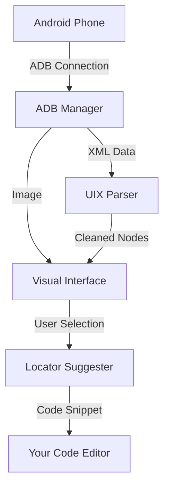

# How It Works (architecture)

> "Think of this tool as an X-Ray machine for your mobile applications."

This document explains the inner workings of the **QUANTUM Inspector** in plain English. You don't need a PhD in Computer Science to understand how we turn your phone screen into a debuggable playground.

## The big picture

The application acts as a bridge between your **Android Device** and your **Desktop**.

1.  **The fetch**: We reach out to your phone (via a cable or Wi-Fi known as ADB) and grab two things:
    *   **The picture**: A visual screenshot of what you see.
    *   **The blueprint**: A hidden file called a "UI Dump" (XML) that lists every button, label, and image on the screen, along with its exact coordinates.
2.  **The processing**: We take that Blueprint, clean it up (because sometimes Android gives us messy data), and map it directly onto the Picture.
3.  **The interaction**: When you click on the image in our app, you aren't just clicking pixels; you are clicking the *blueprint*. This lets us tell you exactly what that button is called, its ID, and how to find it with automation tools.

## Key components (the "engine room")

Here is a breakdown of the main files you'll find in `src/qa_snapshot_tool/` and what they do:

### 1. The brain (`main.py` & `gui.py`)
*   **What it does:** This is the window you see. It handles your mouse clicks, the dark mode theme, and the layout of the panels.
*   **Ideally:** It shouldn't know *how* to talk to phones, just how to show you the results.

### 2. The messenger (`adb_manager.py`)
*   **What it does:** This is our translator. It speaks "Android Debug Bridge" (ADB). It runs commands like "Take a screenshot now" or "Tell me the device name".
*   **Why it matters:** Without this, the app is blind. It handles the gritty details of usb connections.

### 3. The translator (`uix_parser.py`)
*   **What it does:** Android describes screens in a format called XML. It's often deeply nested and complex. This parser reads that raw text and turns it into simple Python objects (`UiNode`) that represent things like "Submit Button" or "Header Text".
*   **Special Power:** It also fixes errors! Sometimes Android reports buttons with negative width (impossible!) or coordinates off-screen. This component sanitizes that data so the app doesn't crash.

### 4. The strategist (`locator_suggester.py`)
*   **What it does:** This is the "QA" part of the tool. When you select an element, this calculator looks at it and thinks: *"If I wanted to find this button again tomorrow, how would I describe it?"*
*   **Result:** It generates code snippets (XPaths, IDs) that you can copy-paste into your test automation scripts (Appium, Selenium, etc.).

## The snapshot "package"

When you save a snapshot, we create a folder specifically for that moment in time. It contains:

*    `screenshot.png`: The visual reference.
*    `dump.uix`: The raw structure data.
*    `logcat.txt`: (Optional) The system logs from the device at that moment - great for seeing *why* an app crashed.
*    `meta.json`: Details like "Google Pixel 6, Android 13, captured at 10:43 AM".

## Data flow diagram

